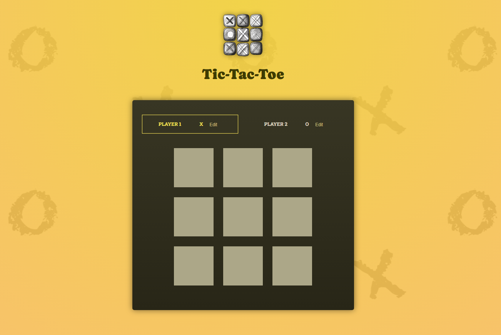

# REACT-TIC-TAC-TOE

Piccolo progetto per iniziare con la libreria di React, basato su un gioco classico, TETRIS!
Principalmente in questo progetto è stato utilizzato uno dei principali HOOK di React : STATE!

 Dopo aver scaricato in locale il progetto , seguire questi passaggi :
 - npm i
 - npm run dev

 